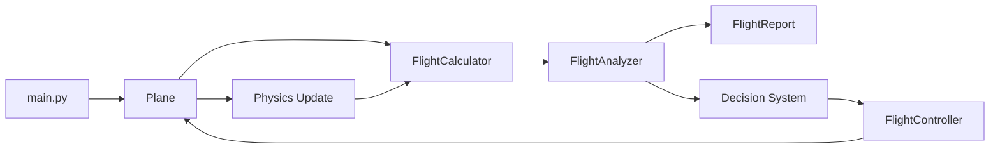
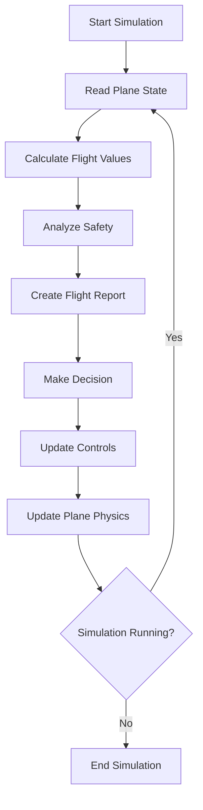
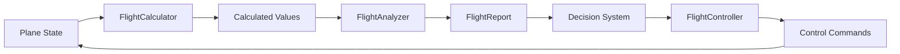

# Learn2Fly Architecture

## 1. Project Purpose

Learn2Fly is an aircraft simulation and flight-control project.

Its purpose is to explore how an aircraft:

* stores and exchanges energy,
* moves through the air,
* detects dangerous situations,
* evaluates risk,
* makes control decisions,
* and applies recovery actions.

The project separates aircraft physics, situation analysis, decision-making, and control into different modules.

This separation helps each class maintain one clear responsibility.

---

## 2. High-Level Architecture

The application follows this general pipeline:



The system operates as a loop:

1. Read the current aircraft state.
2. Calculate flight information.
3. Analyze possible dangers.
4. create a flight report.
5. Choose a control action.
6. Apply the action through the flight controller.
7. Update the aircraft physics.
8. Repeat the process.

---

## 3. Main Simulation Loop

The main program acts like the switch that starts and coordinates the application.

It should not contain detailed physics calculations or flight-safety rules.



---

# 4. Module Responsibilities

## `main.py`

### Responsibility

Starts and coordinates the simulation.

### What it should do

* Create the aircraft.
* Create the calculator, analyzer, controller, and reporting objects.
* Run the simulation loop.
* Pass information between the system components.
* Stop the simulation when necessary.

### What it should not do

* Calculate lift.
* Calculate risk.
* Detect stalls.
* Directly change aircraft variables.
* Contain detailed flight-control rules.

`main.py` should behave like the main switch and coordinator of the system.

---

## `plane.py`

### Main class

```python
Plane
```

### Responsibility

Represents the physical aircraft and stores its current state.

### Example aircraft state

* altitude
* horizontal speed
* vertical speed
* pitch angle
* bank angle
* throttle
* mass
* drag
* maximum thrust
* minimum safe speed
* critical angle of attack

### Main behavior

The Plane class updates the aircraft according to physics.

Possible methods include:

```python
update_physics()
calculate_lift()
calculate_vertical_drag()
flight_path_angle()
calculate_aoa()
pitch_up()
pitch_down()
throttle_up()
throttle_down()
```

### Design rule

The Plane should answer:

> What is the aircraft doing physically?

It should not answer:

> Is this situation dangerous?

That question belongs to the FlightAnalyzer.

---

## `flight_calculator.py`

### Main class

```python
FlightCalculator
```

### Responsibility

Performs reusable mathematical calculations.

It calculates information, but it does not decide whether the situation is safe or dangerous.

### Example calculations

* flight-path angle
* angle of attack
* rate of change
* angle-of-attack rate
* time to stall
* time to impact
* kinetic energy
* potential energy
* total energy
* specific energy
* energy rate

### Example formulas

```text
Kinetic Energy:
KE = 1/2 × m × v²

Potential Energy:
PE = m × g × h

Total Energy:
E = PE + KE

Specific Energy:
e = g × h + v² / 2

Angle of Attack:
AoA = Pitch Angle - Flight Path Angle
```

### Design rule

The FlightCalculator should answer:

> What are the calculated flight values?

It should not answer:

> How serious is the situation?

---

## `flight_analyzer.py`

### Main class

```python
FlightAnalyzer
```

### Responsibility

Interprets the aircraft state and calculated flight information.

The analyzer converts raw numbers into meaningful safety information.

### Possible analysis results

* speed margin
* angle-of-attack margin
* time to stall
* time to impact
* current risk level
* most urgent threat
* aircraft recoverability
* energy condition
* energy trend

### Example safety margins

```text
Speed Margin =
Current Speed - Minimum Safe Speed
```

```text
AoA Margin =
Critical AoA - Current AoA
```

### Questions answered by the analyzer

* Is the aircraft currently in danger?
* How urgent is the danger?
* What is the most important threat?
* How much safety margin remains?
* Is recovery still possible?
* How much control authority remains?

### Design rule

The FlightAnalyzer should interpret information.

It should not directly pitch the aircraft or change the throttle.

---

## `flight_report.py`

### Main class

```python
FlightReport
```

### Responsibility

Collects and presents the results of the flight analysis.

The report acts as a clear package of information that other parts of the program can read.

### Possible report information

```text
Aircraft State
- altitude
- horizontal speed
- vertical speed
- pitch angle
- flight-path angle
- angle of attack
- throttle

Safety Information
- speed margin
- AoA margin
- time to stall
- time to impact
- risk level
- most urgent threat
- recoverability

Energy Information
- specific energy
- energy rate
- energy state
- energy trend
```

### Design rule

The FlightReport should answer:

> What is happening right now?

It should not decide what control action should be taken.

---

## `decision_system.py`

### Possible main function or class

```python
make_decision(report)
```

or later:

```python
FlightDecisionSystem
```

### Responsibility

Chooses the desired aircraft response based on the FlightReport.

For the current project size, a simple function may be enough:

```python
make_decision(report)
```

A separate class should only be introduced when the decision logic becomes large or needs internal state.

### Example decisions

* pitch down to reduce angle of attack
* increase throttle to protect speed
* pitch up to avoid terrain
* maintain current controls
* reduce throttle during overspeed
* prioritize stall recovery over altitude recovery

### Example priority order

```text
1. Prevent immediate stall
2. Prevent ground impact
3. Protect safe airspeed
4. Protect the flight envelope
5. Reach the commanded altitude
6. Improve efficiency and comfort
```

### Design rule

The decision system should answer:

> What should the aircraft try to do?

It should not directly change the aircraft state.

---

## `flight_controller.py`

### Main class

```python
FlightController
```

### Responsibility

Converts decisions into controlled aircraft commands.

The controller changes control targets gradually instead of instantly changing the aircraft.

### Main control areas

```python
update_pitch()
update_throttle()
update_bank()
```

### Example controller state

* target pitch
* target throttle
* target bank angle
* maximum pitch rate
* maximum throttle rate
* maximum bank rate
* controller gains
* deadbands

### Example control flow

```text
Decision:
Increase throttle

Controller:
Move current throttle gradually toward target throttle

Plane:
Use the new throttle during the physics update
```

### Design rule

The FlightController should answer:

> How should the command be applied safely and smoothly?

It should not decide which threat has the highest priority.

---

## `enums.py`

### Responsibility

Stores shared named states used across the project.

### Possible enums

```python
RiskLevel
ThreatType
Recoverability
EnergyState
EnergyTrend
FlightMode
```

### Example values

```python
class RiskLevel(Enum):
    LOW = auto()
    MODERATE = auto()
    HIGH = auto()
    CRITICAL = auto()
```

```python
class ThreatType(Enum):
    NONE = auto()
    STALL = auto()
    IMPACT = auto()
    OVERSPEED = auto()
```

Enums prevent the project from depending on unclear strings such as:

```python
"high"
"High"
"HIGH"
```

Instead, the system uses one controlled value:

```python
RiskLevel.HIGH
```

---

# 5. Information Flow

The information should generally move in one direction:



The Plane provides physical state.

The FlightCalculator creates mathematical values.

The FlightAnalyzer gives those values meaning.

The FlightReport packages the result.

The decision system selects the desired response.

The FlightController applies that response.

The Plane then updates its physical state.

---

# 6. Responsibility Map

| Component          | Main Question                          |
| ------------------ | -------------------------------------- |
| `main.py`          | How does the application run?          |
| `Plane`            | What is the aircraft doing physically? |
| `FlightCalculator` | What values can be calculated?         |
| `FlightAnalyzer`   | What do those values mean?             |
| `FlightReport`     | What is happening right now?           |
| Decision system    | What should the aircraft do?           |
| `FlightController` | How should the action be applied?      |
| Enums              | What shared states can the system use? |

---

# 7. Dependency Direction

The architecture should avoid circular dependencies.

A preferred dependency direction is:

```text
main
 ├── plane
 ├── flight_calculator
 ├── flight_analyzer
 ├── flight_report
 ├── decision_system
 └── flight_controller
```

Lower-level modules should not depend on the main application.

For example:

```text
Correct:
main.py imports Plane

Incorrect:
plane.py imports main.py
```

The Plane should not need to know that the FlightAnalyzer exists.

The FlightAnalyzer may read aircraft information, but the aircraft should remain independent from the analyzer.

---

# 8. Current Suggested Project Structure

```text
learn2fly/
├── main.py
├── plane.py
├── flight_calculator.py
├── flight_analyzer.py
├── flight_report.py
├── flight_controller.py
├── decision_system.py
├── enums.py
├── constants.py
│
├── docs/
│   └── ARCHITECTURE.md
│
├── tests/
│   ├── test_plane.py
│   ├── test_flight_calculator.py
│   ├── test_flight_analyzer.py
│   ├── test_flight_controller.py
│   └── test_decision_system.py
│
├── notes/
│   └── dev_journal.md
│
├── README.md
└── pyproject.toml
```

This is a suggested structure, not a strict final structure.

The project structure can evolve as Learn2Fly becomes larger.

---

# 9. Important Architecture Rules

## Rule 1: One main responsibility per class

A class may contain several related methods, but they should serve one main purpose.

For example, the FlightAnalyzer can calculate risk, threats, and recoverability because all of them belong to flight-safety interpretation.

---

## Rule 2: Calculating is different from interpreting

```text
FlightCalculator:
Time to impact = 3.4 seconds

FlightAnalyzer:
3.4 seconds means HIGH risk
```

The calculation produces the number.

The analyzer explains what the number means.

---

## Rule 3: Deciding is different from controlling

```text
Decision System:
The aircraft should pitch down.

FlightController:
Move pitch from 10° to 8° using the allowed pitch rate.
```

The decision system selects the goal.

The controller applies the goal gradually.

---

## Rule 4: Physics should remain inside the aircraft model

The controller should not directly calculate altitude or speed changes.

It changes aircraft controls.

The Plane then calculates the physical result.

```text
Controller changes throttle
        ↓
Plane calculates thrust
        ↓
Physics changes speed
```

---

## Rule 5: Reports should contain data, not behavior

The FlightReport should package information.

It should not change throttle, pitch, altitude, or speed.

---

# 10. Future Architecture

As Learn2Fly grows, the architecture may later include:

```text
SimulationEngine
FlightEnvironment
WeatherModel
SensorSystem
NavigationSystem
MissionPlanner
AutopilotModes
DataRecorder
VisualizationSystem
MachineLearningPilot
HardwareInterface
```

These should not be added before the current architecture needs them.

The project should grow because of real responsibilities, not only because more classes look impressive.

---

# 11. Architecture Summary

Learn2Fly is organized around a repeating flight-control loop:

```text
Observe
   ↓
Calculate
   ↓
Analyze
   ↓
Report
   ↓
Decide
   ↓
Control
   ↓
Update Physics
   ↓
Repeat
```

Each part of the system has a clear purpose:

```text
Plane              = Physical aircraft
FlightCalculator   = Mathematics
FlightAnalyzer     = Interpretation
FlightReport       = Communication
Decision System    = Choice
FlightController   = Execution
main.py            = Coordination
```

This architecture allows Learn2Fly to grow without turning every module into one large and confusing system.
